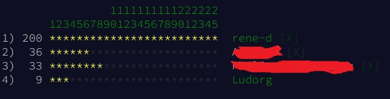

# [Advent of Code 2022](https://adventofcode.com/2022) in Rust 🦀

Link to repos of Rustacean colleagues:

- [René et al](https://github.com/rene-d/advent-of-rust/)
- [Philippe/Gueven](https://github.com/pbouamriou/adventofcode_2022_rust)

## My Advance

| Day | Step 1 | Step 2 |
| :-: | :----: | :----: |
|  1  | ⭐ | ⭐ |
|  2  | ⭐ | ⭐ |
|  3  | ⭐ | ⭐ |
|  4  |        |        |
|  5  |        |        |

---

NB: Puzzle inputs differ by user. Please log in to get your puzzle input.

## Day 1

See instructions [here](https://adventofcode.com/2022/day/1)

### Step 1

Completed ⭐

### Step 2

Completed ⭐

## Day 2

See instructions [here](https://adventofcode.com/2022/day/2)

### Step 1

Completed ⭐

### Step 2

Completed ⭐

## Day 3

See instructions [here](https://adventofcode.com/2022/day/3)

### Step 1

Completed ⭐

### Step 2

Completed ⭐

---

## Final words

In 2022, I caught one more star than in 2021!
Despite having begun on time, due to some other emergencies to manage, I could'nt find the time to solve the puzzles. The three ones I completed were coded with  [Codespaces](https://github.com/features/codespaces).

This Advent of Code 2022 in Rust was however really fun to do this with my colleague and friend [@rene-d](https://github.com/rene-d). Next year, I hope to go a little bit further.

Happy new Year 2🦀23!
